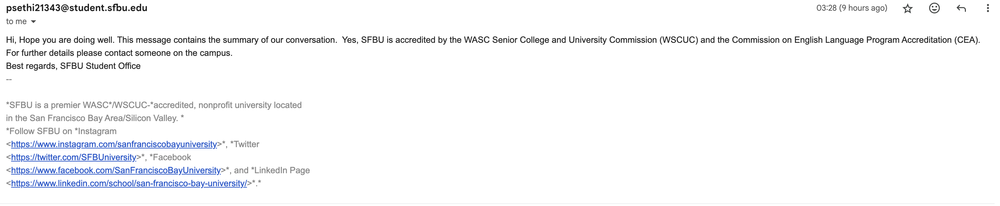

# University_AI_Chatbot

## Introduction

This AI chatbot is designed to streamline access to university information by providing quick and comprehensive answers in multiple languages. It is ideal for students, staff, and visitors seeking assistance.

## Key Features

- **Multilingual Support**: Offers responses in several languages, making it accessible to a diverse audience.
- **Powered by AI**: Utilizes a customized version of OpenAI's GPT-3.5 Turbo, enhanced with specific training to cater to university-related queries.
- **Resource Integration**: Incorporates various data sources, including academic catalogs, video content, and web data, ensuring well-rounded responses.
- **Safety Features**: Includes advanced mechanisms to prevent hallucinations and prompt injections, ensuring the reliability and accuracy of information.

## Technology Stack

- **Development Platform**: Ubuntu Linux
- **Programming**: Python
- **AI and Natural Language Processing**: OpenAI API, enhanced with Langchain for advanced data retrieval
- **Database**: ChromaDB
- **Speech Technologies**: OpenAI Whisper for speech recognition and OpenAI TTS for voice responses
- **Front-End and Deployment**: Streamlit, deployed on AWS
- **Safety Features**: Focused on reducing hallucinations and prompt injections for reliable information delivery

## Development Status

This project is currently in a testing phase with ongoing adjustments to enhance functionality and user interaction. Upon completion, the chatbot will be integrated into the university's official website.

## Code Availability

Due to the ongoing development and testing process, only select code snippets are currently available in this repository. These snippets demonstrate our approach without revealing the full proprietary logic essential for the final deployment.

## Screenshots

### UI

### Model Config

### Choose Temerature

### Language Config

### Voice Config

### Generated Text Response and Voice Response

### Response in email format

### Email Recieved

